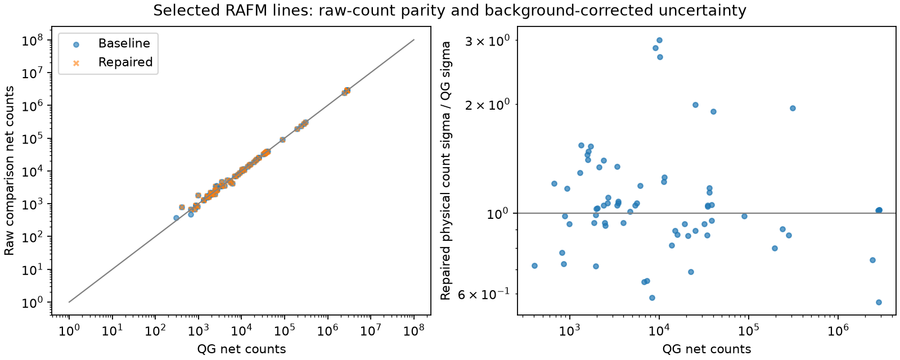

# RAFM analysis issue repairs — 2 October 2026

This first batch repairs peak recovery/counting, shared activation clocks, target inventories, and unfolding numerics in **FusionSandwich/FluxForge**. The supplied checkout contains these workflows and the RAFM data. The latest remote analysis branch was verified at `1148e18a53a156d74029e84ed528e5fcd9cfd263`; the implementation is commit `320161afa42d3849c28e75f8c3d3a8316eb8aef0` on `codex/rafm-analysis-issues`.

All work and new outputs are in the separate managed worktree. The other chat's checkout, environment and existing validation receipts were not changed. ParaStell was not the repository supplied for this task.

## Issue coverage

| Issue | Repair and evidence in this batch | Remaining scope |
| --- | --- | --- |
| [#15](https://github.com/FusionSandwich/FluxForge/issues/15) measured background | Physical activity uses the signed measured-background residual; raw reference comparisons have separate fits. Supplied channel variance reaches ROI and fit calculations. Ambient-only synthetic spectra fail the sample-activity significance check in all four counting methods. | Broader calibration and systematic uncertainty qualification. |
| [#24](https://github.com/FusionSandwich/FluxForge/issues/24) peak recovery/identification | Reject unsupported seed/fitted energies, remove duplicate maximum assignments, retain a resolved weak doublet, and retry another in-tolerance maximum when a singleton's closest noise fit fails. Both previously lost Ti Sc-47 fixtures recover without widening the 2 keV tolerance. | Audit every library line and recurring missing/unidentified RAFM peaks. |
| [#25](https://github.com/FusionSandwich/FluxForge/issues/25) peak/activity uncertainty | Gaussian, multiplet and Hypermet fits accept channel sigma. Physical and comparison count sigma retain the propagated ROI floor. Linear-continuum uncertainty includes endpoint reuse covariance. Line-by-line remaining differences are in the CSV below. | Efficiency, emission-probability and sample-specific systematic terms; full component covariance. |
| [#194](https://github.com/FusionSandwich/FluxForge/issues/194) row-unit weighting | Extend the existing iterative repairs to ML seed generation/warm updates and Gaussian RMLE by whitening measurement/response rows together. Synthetic and frozen RAFM row-rescaling checks pass. | External reference parity and physical spectrum qualification. |
| [#195](https://github.com/FusionSandwich/FluxForge/issues/195) solver stopping/statistics | Failed NNLS uses bounded least squares with its numerical outcome rather than clipped unconstrained least squares. ML seed reports the defined weighted residual sum of squares; confidence is explicitly heuristic. Registry uncertainty remains unavailable with reasons. | Estimator-consistent covariance and full separation of every heuristic acceptance from numerical stopping. |
| [#197](https://github.com/FusionSandwich/FluxForge/issues/197) irradiation history | Fix the shared sigphi single-segment path so relative power is respected. A half-power analytic case and existing ordered history/missing-schedule regressions pass. | Burnup and broader irradiation-model qualification. |
| [#198](https://github.com/FusionSandwich/FluxForge/issues/198) count decay | Consolidate on a stable clock-time decay factor. Live acceptance enters once. GUI/CLI review and ASTM consumers pass real time; explicit report declarations prevent duplicate correction. Synthetic 0/10/25/30% dead-time cases recover truth. | Nonuniform acquisition acceptance needs an explicit time-dependent model. |
| [#204](https://github.com/FusionSandwich/FluxForge/issues/204) material/default inputs | Reject unknown atomic masses and product/element mismatches; expose element mass fraction during extraction; reject explicit invalid composition/correction inputs. E262 now divides by each monitor's own inventory and normalizes Cd/standard comparisons per target atom. | Complete assumption/provenance contracts across all APIs; some lower-level pure-material defaults remain. |

Issue snapshots are preserved in [issue_snapshot.json](issue_snapshot.json). These are bounded repairs, not closure claims for all eight broad issues. The existing registry uncertainty safeguards, including the earlier RMLE default-error repair, were retained.

## Verification

**446 distinct repository checks and 74 independent antagonist checks have passing final results.** Test identities are reconciled in [validation_receipt.json](validation_receipt.json), so repeated checks are counted once.

| Run | Result | Interpretation |
| --- | --- | --- |
| Broad relevant suite | 414 passed, 1 failed / 415 | The sole failure exposed the Sc-47 noise-seed regression; retained as diagnostic history. |
| Final affected workflows and history/default checks | 125 passed | After the retry repair; includes the formerly failing parity check and both new titanium regressions. |
| GUI activity core helpers | 2 passed | Dedicated noninteractive checks; exhaustive interactive GUI verification is outside this batch. |
| Preserved antagonist tests reproduced from this directory | 74 passed | Independent analytic, numerical and adversarial cases from three reviewers. |

All three antagonist agents accepted their reviewed final source hashes. Their [receipts and independent test sources](antagonist/) are preserved. Activation review also independently tested different bare/Cd/standard inventories, count clocks and cooling times. Known-truth E262 tests recover a `1e10 cm^-2 s^-1` input flux, including comparisons with unequal monitor inventories. Explicit zero/negative/NaN/infinite supplied cross-sections are rejected; only absent cross-section fields use the governed library fallback.

The legacy reference-conditioned parity test copies supplied QG report activities. Its passing result establishes compatibility, not an independent activity validation. [reference_conditioned_parity.csv](reference_conditioned_parity.csv) is labelled accordingly. An earlier silent combined run was interrupted and is excluded from passing evidence.

## RAFM replay

The frozen baseline and repaired code read **29 raw sample spectra: 10 wire spectra and 19 RAFM material spectra**, plus the shared background. The 64 recorded input hashes are identical before/after. Final runtime hashes cover 247 Python source files and match the committed working-tree contents.

Wire targets use the declared wire library. Material targets are a bounded set: Cr-51 320.08, W-187 685.74, Mn-54 834.84 and both Co-60 lines. This is not an exhaustive generic-library or transport validation. All five selected lines are recovered in each late RAFM4 spectrum. The selected output count changes from 118 to 97 after support, uncertainty and physical-background checks; that reduction alone is not a recovery score.

The four separate off-energy probes are W-187 206.25 in RAFM4-C, Tb-154m 247.94 in RAFM4-N, and V-52 1434.09 / Mn-56 2113.09 in RAFM4-A. Three were emitted by the baseline; none are emitted by the repaired code. The fourth was already rejected. Independent review retains all ten authentic selected lines across RAFM4-A/C.



The left panel compares raw reference diagnostics with QG. Existing QG-mode manual compatibility overrides remain in this path, so this panel is not wholly independent of reference settings. Physical sample counts still use the measured residual. The right compares physical background-corrected count sigma with QG's report sigma. Their background and uncertainty assumptions differ; agreement does not establish physical truth or qualified uncertainty.

| Late spectrum/line | Physical net counts | Physical count sigma | QG net counts | QG sigma |
| --- | ---: | ---: | ---: | ---: |
| RAFM4-A Cr-51 320.08 | 2,860,966 | 2,366.88 | 2,855,549 | 2,320 |
| RAFM4-A W-187 685.74 | 4,626.25 | 885.92 | 6,118 | 745 |
| RAFM4-C W-187 685.74 | 3,945.88 | 659.34 | 3,966 | 700 |
| RAFM4-C Co-60 1332.49 | 2,457.88 | 249.77 | 3,496 | 234 |

Large differences remain visible: the W-187 RAFM4-A physical count is about 24.4% below QG, while RAFM4-C is about 0.5% below. Co-60 1332.49 in RAFM4-C is about 29.7% below QG. The complete before/after counts, raw comparisons, sigmas and missing selections are in [peak_count_comparison.csv](peak_count_comparison.csv); the largest uncertainty discrepancies are also in [summary.json](summary.json). Ti-RAFM-1b Sc-48 983.5 has physical sigma 910.75 versus QG 303, approximately a factor of 3.01. These discrepancies require further uncertainty/model work.

The separate raw/signed multiplet truth case recovers physical areas 1503.98/902.39 and raw comparison areas 7519.88/3910.34, matching their own analytic Gaussian integrals. An ambient peak therefore does not become physical sample activity through a raw comparison fit.

Thirty-five QG wire peak observations provide the count-clock audit in [clock_activity_comparison.csv](clock_activity_comparison.csv). The independent [processed-report timing audit](antagonist/activation/rafm_timing_audit.json) also covers all thirteen wire reports, including reports without bundled raw counterparts. For the same supplied counts, the previous shared helper exceeded the corrected result by about 14.6% for bare Sc-46, 5.35% for bare Cu-64, and 1.78% for Cd-covered Cu-64. These are helper timing comparisons, not known physical activities; report efficiency/decay settings still need qualification.

The frozen 13-row × 20-group RAFM response is tested with automatic/ones priors and zero/eight warm updates. Before the repair, pure row-unit changes altered the seed substantially. After the repair, maximum absolute flux differences across all four cases are at most `7.75e-14` in the replay's scaled flux coordinates. With eight warm updates, weighted residual sums of squares are 419.8969 and 419.9503 for the two priors. All four heuristic seeds remain rejected by their confidence gate. Numerical unit invariance does not resolve the underdetermined spectrum or its uncertainty.

## Input changes and remaining work

E262 now requires `target_atoms`, or `sample_mass_g` plus `atomic_mass_g_mol`, for each physical monitor. Cd fields use `cd_`; standard-comparison fields use `unknown_` and `standard_`. Composition factors may be supplied separately and must be finite, positive fractions no greater than one. Previously incomplete plans must be updated rather than returning a plausible flux without target normalization.

The count-clock model assumes uniform live/real acceptance over the count. Supplied nonzero dead fraction must agree with explicit clocks. Report activities already corrected to count start require an explicit declaration and receive no second count-decay correction.

Broader [#199 uncertainty work](https://github.com/FusionSandwich/FluxForge/issues/199) remains: the generic rate helper still invents an uncertainty from activity instead of propagating supplied activity sigma; ASTM budgets omit inventory/background-fit covariance; clipped near-zero bare-minus-Cd signals need a censored/zero-signal uncertainty treatment. Calibration, efficiency, gamma-yield and nuclear-response systematics are not qualified by this replay. Registry flux uncertainty remains unavailable, and `scientific_admission` remains false.

Full generic RAFM nonlinear fits can take several minutes; this was already observed in the baseline, and separate raw comparison fits add work. No performance claim is made.

## Reproduction

Use Python 3.12 with the repository's dependencies and `PYTHONPATH` set to the chosen source directory. The shared runtime was read without installing or changing packages.

```powershell
$env:PYTHONPATH = (Resolve-Path src).Path
python tools/validate_analysis_issues_rafm.py --root . --source-root src --out scratch/rafm_replay.json
python -m pytest -q artifacts/validation/analysis_issues_20261002/antagonist
```

The replay refuses to overwrite an existing output. To reproduce the baseline, extract `src` at commit `1148e18` into a separate directory and point both `PYTHONPATH` and `--source-root` there. The comparison tool expects `rafm_before.json` and `rafm_final.json` in its output directory and verifies all final runtime hashes before summarizing.
